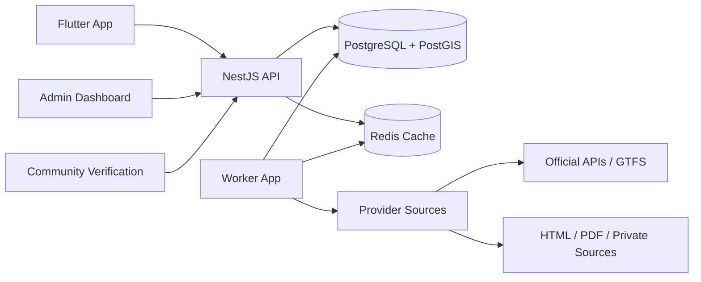

# Platform Architecture

The platform uses a modular monolith first, with clean boundaries that can later split into services when scale demands it.

See also: [architecture.md](architecture.md), [adr/0003-hexagonal-architecture.md](adr/0003-hexagonal-architecture.md), and [adr/0008-canonical-model.md](adr/0008-canonical-model.md).

## Core Stack

| Layer | Choice |
| --- | --- |
| Mobile app | Flutter |
| API | NestJS |
| Database | PostgreSQL with PostGIS |
| ORM | Sequelize |
| Queue | BullMQ with Redis |
| Provider jobs | Worker app |
| Routing | PostGIS first, RAPTOR/CSA later |
| Admin | Web dashboard, likely React/Next.js |

## High-Level Diagram



## Bounded Contexts

| Context | Responsibility |
| --- | --- |
| Transit | Agencies, stops, routes, trips, stop times |
| Journey | Route planning, transfer graph, walking legs |
| Provider | Source ingestion, parsing, normalization |
| Coverage | State, district, city readiness and gaps |
| Community | Submissions, verification, reputation |
| Admin | Operations, moderation, source quality |
| AI Planner | Conversational planning and explanations |

## Architectural Rules

- Domain modules must not import NestJS or Sequelize.
- Providers emit canonical transit records, not database entities.
- Database entities stay in infrastructure.
- Use cases orchestrate repositories and domain services.
- Provider-specific quirks stay inside provider adapters.
- Every imported record must retain source metadata.

## Feature-Driven Module Pattern

New backend code should be organized by feature first, layer second:

```text
modules/
  transit/
    domain/
    application/
    infrastructure/
      sequelize/
        models/
        repositories/
        mappers/
    presentation/
  regions/
    domain/
    application/
    infrastructure/
    presentation/
  journey/
    domain/
    application/
    infrastructure/
    presentation/
```

This keeps a developer inside one feature folder for most changes. Shared utilities belong in `shared/`; provider-specific logic belongs in provider drivers.

## Region-Scoped API Pattern

Coverage owns launch geography. Transit owns stops, routes, trips, and stop times. Region-scoped endpoints compose both modules:

```text
GET /v1/coverage/regions
GET /v1/coverage/regions/:slug
GET /v1/regions/:slug/stops/nearby
GET /v1/regions/:slug/routes
```

The coverage registry maps each slug to a modular scope:

- Geography: country, state, district, city
- Provider drivers: `wbbus`, `bmtc`, `kerala-rtc`, `delhi-otd`
- Launch status: planned, research, beta, live
- Supported APIs: stops, routes, journey, coverage

This keeps state/city launches independent from provider implementation details.
