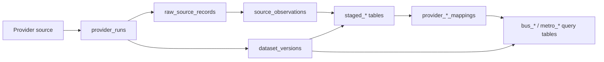
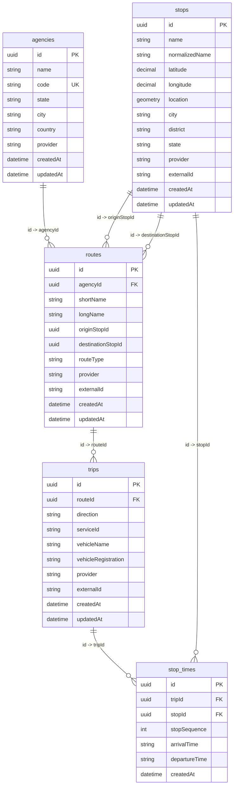

# Database ER Diagram

This ERD reflects the current Sequelize-backed API database in `apps/api/src/modules/**/infrastructure/sequelize/models`.

For browser-friendly views, open [05-er-diagram.html](05-er-diagram.html) or the dark interactive wiring map at [05-er-wiring.html](05-er-wiring.html).

The platform database has two active layers:

- **Provider ingestion layer**: raw sources, provider runs, dataset versions, staged canonical records, source observations, and identity mappings.
- **Promoted query layer**: materialized bus and metro tables served by public APIs.

The older `agencies`, `routes`, `stops`, `trips`, and `stop_times` tables still exist for the transit module and are shown separately near the end.

## Current Core ERD

```mermaid
erDiagram
  providers {
    uuid id PK
    string code UK
    string name
    string sourceType
    text website
    string version
    string_array transportModes
    datetime createdAt
    datetime updatedAt
  }

  provider_sources {
    uuid id PK
    string providerCode
    text sourceUrl
    string sourceRole
    string status
    jsonb metadata
    datetime createdAt
    datetime updatedAt
  }

  provider_runs {
    uuid id PK
    string providerCode
    string providerVersion
    string status
    string runType
    text checkpoint
    text lastDiscoveryCursor
    int discoveredCount
    int fetchedCount
    int parsedCount
    int failedCount
    text lastProcessedExternalId
    jsonb metrics
    text errorMessage
    datetime createdAt
    datetime updatedAt
  }

  provider_item_checkpoints {
    uuid id PK
    uuid providerRunId FK
    string providerCode
    text externalId
    text sourceUrl
    string status
    string contentHash
    text errorMessage
    datetime createdAt
    datetime updatedAt
  }

  raw_source_records {
    uuid id PK
    string providerCode
    uuid providerRunId FK
    text sourceUrl
    string contentHash
    string contentType
    int statusCode
    jsonb rawPayload
    jsonb metadata
    string status
    datetime fetchedAt
    datetime createdAt
    datetime updatedAt
  }

  datasets {
    uuid id PK
    string providerCode
    string name
    string status
    datetime createdAt
    datetime updatedAt
  }

  dataset_versions {
    uuid id PK
    uuid datasetId FK
    uuid providerRunId FK
    string contentHash
    jsonb validationSummary
    string status
    datetime createdAt
    datetime updatedAt
  }

  source_observations {
    uuid id PK
    string providerCode
    string providerVersion
    uuid rawSourceRecordId FK
    text sourceUrl
    string contentHash
    decimal confidence
    string verificationStatus
    string_array warnings
    datetime createdAt
    datetime updatedAt
  }

  staged_agencies {
    uuid id PK
    uuid datasetVersionId FK
    string providerCode
    text providerExternalId
    uuid sourceObservationId FK
    string validationStatus
    string operationalStatus
    date effectiveFrom
    date effectiveUntil
    datetime lastObservedAt
    datetime lastVerifiedAt
    jsonb canonicalPayload
    datetime createdAt
    datetime updatedAt
  }

  staged_nodes {
    uuid id PK
    uuid datasetVersionId FK
    string providerCode
    text providerExternalId
    uuid sourceObservationId FK
    string validationStatus
    string operationalStatus
    jsonb canonicalPayload
    datetime createdAt
    datetime updatedAt
  }

  staged_routes {
    uuid id PK
    uuid datasetVersionId FK
    string providerCode
    text providerExternalId
    uuid sourceObservationId FK
    string validationStatus
    string operationalStatus
    jsonb canonicalPayload
    datetime createdAt
    datetime updatedAt
  }

  staged_route_stops {
    uuid id PK
    uuid datasetVersionId FK
    string providerCode
    text providerExternalId
    uuid sourceObservationId FK
    string validationStatus
    string operationalStatus
    jsonb canonicalPayload
    datetime createdAt
    datetime updatedAt
  }

  staged_trips {
    uuid id PK
    uuid datasetVersionId FK
    string providerCode
    text providerExternalId
    uuid sourceObservationId FK
    string validationStatus
    string operationalStatus
    jsonb canonicalPayload
    datetime createdAt
    datetime updatedAt
  }

  staged_stop_times {
    uuid id PK
    uuid datasetVersionId FK
    string providerCode
    text providerExternalId
    uuid sourceObservationId FK
    string validationStatus
    string operationalStatus
    jsonb canonicalPayload
    datetime createdAt
    datetime updatedAt
  }

  staged_fares {
    uuid id PK
    uuid datasetVersionId FK
    string providerCode
    text providerExternalId
    uuid sourceObservationId FK
    string validationStatus
    string operationalStatus
    jsonb canonicalPayload
    datetime createdAt
    datetime updatedAt
  }

  provider_agency_mappings {
    uuid id PK
    string providerCode
    text providerExternalId
    uuid agencyId
    string resolutionStatus
    decimal confidence
    jsonb evidence
    datetime createdAt
    datetime updatedAt
  }

  provider_node_mappings {
    uuid id PK
    string providerCode
    text providerExternalId
    uuid nodeId
    string resolutionStatus
    decimal confidence
    jsonb evidence
    datetime createdAt
    datetime updatedAt
  }

  provider_route_mappings {
    uuid id PK
    string providerCode
    text providerExternalId
    uuid routeId
    string resolutionStatus
    decimal confidence
    jsonb evidence
    datetime createdAt
    datetime updatedAt
  }

  provider_trip_mappings {
    uuid id PK
    string providerCode
    text providerExternalId
    uuid tripId
    string resolutionStatus
    decimal confidence
    jsonb evidence
    datetime createdAt
    datetime updatedAt
  }

  bus_routes {
    uuid id PK
    string providerCode
    text externalId
    text longName
    string directionId
    string operationalStatus
    uuid datasetVersionId FK
    jsonb metadata
    datetime createdAt
    datetime updatedAt
  }

  bus_stops {
    uuid id PK
    string providerCode
    text externalId
    text name
    text normalizedName
    uuid datasetVersionId FK
    jsonb metadata
    datetime createdAt
    datetime updatedAt
  }

  bus_route_stops {
    uuid id PK
    uuid routeId FK
    uuid stopId FK
    int sequence
    uuid datasetVersionId FK
    datetime createdAt
    datetime updatedAt
  }

  bus_trips {
    uuid id PK
    string providerCode
    text externalId
    uuid routeId FK
    string direction
    text vehicleRegistration
    text vehicleName
    string operationalStatus
    uuid datasetVersionId FK
    jsonb metadata
    datetime createdAt
    datetime updatedAt
  }

  bus_stop_times {
    uuid id PK
    uuid tripId FK
    uuid stopId FK
    int sequence
    string arrivalTime
    string departureTime
    uuid datasetVersionId FK
    datetime createdAt
    datetime updatedAt
  }

  metro_lines {
    uuid id PK
    string providerCode
    text externalId
    text name
    string color
    string operationalStatus
    uuid datasetVersionId FK
    datetime createdAt
    datetime updatedAt
  }

  metro_stations {
    uuid id PK
    string providerCode
    text externalId
    text name
    text normalizedName
    boolean isInterchange
    uuid datasetVersionId FK
    jsonb metadata
    datetime createdAt
    datetime updatedAt
  }

  metro_line_stations {
    uuid id PK
    uuid lineId FK
    uuid stationId FK
    int sequence
    uuid datasetVersionId FK
    datetime createdAt
    datetime updatedAt
  }

  coverage_areas {
    uuid id PK
    string countryCode
    string stateCode
    text stateName
    text districtName
    text cityName
    string areaType
    text name
    text slug
    jsonb metadata
    datetime createdAt
    datetime updatedAt
  }

  provider_coverage_areas {
    uuid id PK
    uuid providerId FK
    uuid coverageAreaId FK
    string relationshipType
    jsonb metadata
    datetime createdAt
    datetime updatedAt
  }

  route_coverage_areas {
    uuid id PK
    uuid routeId FK
    uuid coverageAreaId FK
    string relationshipType
    jsonb metadata
    datetime createdAt
    datetime updatedAt
  }

  dataset_coverage_areas {
    uuid id PK
    uuid datasetId FK
    uuid coverageAreaId FK
    string relationshipType
    jsonb metadata
    datetime createdAt
    datetime updatedAt
  }

  canonical_conflicts {
    uuid id PK
    uuid datasetVersionId FK
    string providerCode
    string entityType
    text providerExternalId
    string conflictType
    string status
    jsonb details
    datetime createdAt
    datetime updatedAt
  }

  providers ||--o{ provider_sources : "code -> providerCode"
  providers ||--o{ provider_runs : "code -> providerCode"
  provider_runs ||--o{ provider_item_checkpoints : "id -> providerRunId"
  provider_runs ||--o{ raw_source_records : "id -> providerRunId"
  provider_runs ||--o{ dataset_versions : "id -> providerRunId"
  raw_source_records ||--o{ source_observations : "id -> rawSourceRecordId"
  datasets ||--o{ dataset_versions : "id -> datasetId"

  dataset_versions ||--o{ staged_agencies : "id -> datasetVersionId"
  dataset_versions ||--o{ staged_nodes : "id -> datasetVersionId"
  dataset_versions ||--o{ staged_routes : "id -> datasetVersionId"
  dataset_versions ||--o{ staged_route_stops : "id -> datasetVersionId"
  dataset_versions ||--o{ staged_trips : "id -> datasetVersionId"
  dataset_versions ||--o{ staged_stop_times : "id -> datasetVersionId"
  dataset_versions ||--o{ staged_fares : "id -> datasetVersionId"

  source_observations ||--o{ staged_agencies : "id -> sourceObservationId"
  source_observations ||--o{ staged_nodes : "id -> sourceObservationId"
  source_observations ||--o{ staged_routes : "id -> sourceObservationId"
  source_observations ||--o{ staged_route_stops : "id -> sourceObservationId"
  source_observations ||--o{ staged_trips : "id -> sourceObservationId"
  source_observations ||--o{ staged_stop_times : "id -> sourceObservationId"
  source_observations ||--o{ staged_fares : "id -> sourceObservationId"

  dataset_versions ||--o{ bus_routes : "id -> datasetVersionId"
  dataset_versions ||--o{ bus_stops : "id -> datasetVersionId"
  dataset_versions ||--o{ bus_route_stops : "id -> datasetVersionId"
  dataset_versions ||--o{ bus_trips : "id -> datasetVersionId"
  dataset_versions ||--o{ bus_stop_times : "id -> datasetVersionId"
  bus_routes ||--o{ bus_route_stops : "id -> routeId"
  bus_stops ||--o{ bus_route_stops : "id -> stopId"
  bus_routes ||--o{ bus_trips : "id -> routeId"
  bus_trips ||--o{ bus_stop_times : "id -> tripId"
  bus_stops ||--o{ bus_stop_times : "id -> stopId"

  dataset_versions ||--o{ metro_lines : "id -> datasetVersionId"
  dataset_versions ||--o{ metro_stations : "id -> datasetVersionId"
  dataset_versions ||--o{ metro_line_stations : "id -> datasetVersionId"
  metro_lines ||--o{ metro_line_stations : "id -> lineId"
  metro_stations ||--o{ metro_line_stations : "id -> stationId"

  provider_node_mappings }o--|| bus_stops : "nodeId -> id"
  provider_node_mappings }o--|| metro_stations : "nodeId -> id"
  provider_route_mappings }o--|| bus_routes : "routeId -> id"
  provider_route_mappings }o--|| metro_lines : "routeId -> id"
  provider_trip_mappings }o--|| bus_trips : "tripId -> id"

  coverage_areas ||--o{ provider_coverage_areas : "id -> coverageAreaId"
  coverage_areas ||--o{ route_coverage_areas : "id -> coverageAreaId"
  coverage_areas ||--o{ dataset_coverage_areas : "id -> coverageAreaId"
  providers ||--o{ provider_coverage_areas : "id -> providerId"
  bus_routes ||--o{ route_coverage_areas : "id -> routeId"
  datasets ||--o{ dataset_coverage_areas : "id -> datasetId"

  dataset_versions ||--o{ canonical_conflicts : "id -> datasetVersionId"
```

## Ingestion Flow

## Promotion Targets

| Provider mode | Promoted tables |
| --- | --- |
| Bus / private bus | `bus_routes`, `bus_stops`, `bus_route_stops`, `bus_trips`, `bus_stop_times` |
| Metro | `metro_lines`, `metro_stations`, `metro_line_stations` |
| Future ferry / rail / auto | Should reuse staged canonical tables first, then add mode-specific query tables only when the API needs fast reads |

## Identity Mapping Tables

| Mapping table | Purpose |
| --- | --- |
| `provider_agency_mappings` | Maps provider agency IDs to canonical agencies when agency promotion is added |
| `provider_node_mappings` | Maps provider stop/station IDs to promoted node records such as `bus_stops` or `metro_stations` |
| `provider_route_mappings` | Maps provider route/line IDs to promoted route records such as `bus_routes` or `metro_lines` |
| `provider_trip_mappings` | Maps provider trip IDs to promoted `bus_trips` |

At present, these mappings are polymorphic by convention. For example, `provider_node_mappings.nodeId` can point to `bus_stops.id` or `metro_stations.id` depending on `providerCode` and `entityType` semantics.

## Legacy Transit Tables

These tables are still part of `TransitModule`. They are separate from the newer provider-ingestion promotion tables and should eventually be reconciled or retired once the canonical mobility model fully owns query serving.

## Notes

- Tables use UUID v7 IDs through `ensureUuidV7`.
- Several relationships are represented in code by ID columns but are not yet declared as database-level foreign keys in every Sequelize model.
- `providerCode` links many tables to `providers.code` by convention.
- `source_observations` are the provenance bridge between raw fetched records and staged canonical records.
- `dataset_versions.status = ACTIVE` determines what public query endpoints should serve.
- `DB_SYNCHRONIZE=true` can create these tables during development, but production should move to explicit migrations.
