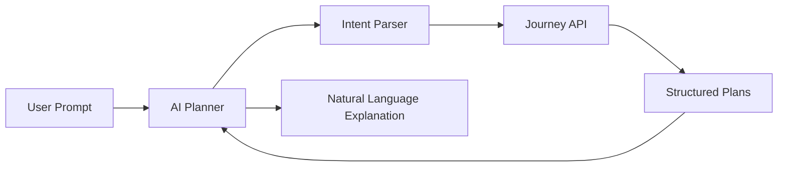

# AI Planner

## Purpose

The AI planner should explain and personalize journeys. It should not invent transit facts.

## Responsibilities

- Convert natural language into structured journey requests.
- Resolve ambiguous landmarks with geocoding and user confirmation.
- Explain tradeoffs between routes.
- Summarize disruptions and low-confidence data.
- Translate route instructions into local languages.
- Help admins investigate coverage gaps.

## Guardrails

- The journey engine remains the source of route truth.
- The AI layer must cite internal data sources and confidence.
- If coverage is missing, it should say so directly.
- It must not fabricate timings, routes, fares, or agencies.

## Architecture

